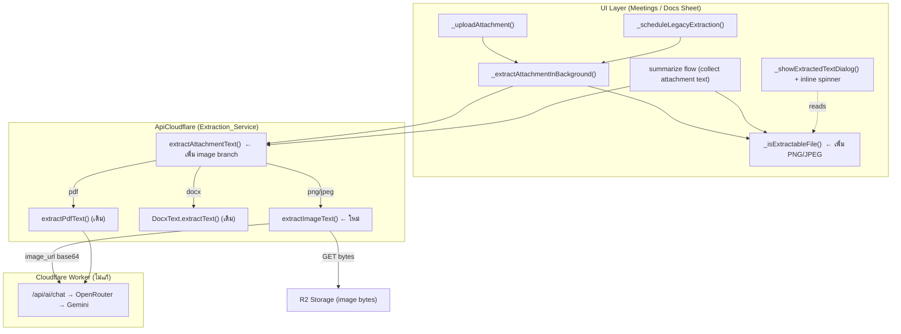

# Design Document: Image Text Extraction (Meetings & Docs)

## Overview

ฟีเจอร์นี้ขยายระบบ text extraction ที่มีอยู่ ให้รองรับการดึงข้อความจากไฟล์รูปภาพ (PNG, JPEG) ผ่าน Gemini Vision AI นอกเหนือจาก PDF/DOCX ที่รองรับอยู่แล้ว โดยทำงานทั้งในหน้า Meetings (`meetings_board_sheet.dart`) และหน้า Docs (`docs_board_sheet.dart`)

### Design Goal: Minimal Disruption, Maximum Reuse

การสำรวจ codebase พบว่าโครงสร้างที่มีอยู่รองรับการขยายนี้ได้เกือบทั้งหมดอยู่แล้ว — การออกแบบจึงเน้น **extend ไม่ใช่ rewrite**:

1. **ไม่ต้องแก้ Cloudflare Worker เลย** — route `/api/ai/chat` รองรับ `image_url` content type อยู่แล้ว (ใช้โดย `generateAiDescription`) และโมเดล `google/gemini-3.1-flash-lite` อยู่ใน `ALLOWED_MODELS` แล้ว
2. **เพิ่ม branch เดียวใน `extractAttachmentText`** — routing logic เดิมตรวจ `.pdf` / `.docx` อยู่แล้ว เพิ่มกรณีรูปภาพต่อท้าย
3. **ขยาย `_isExtractableFile` ในทั้งสอง sheet** — เพิ่มการตรวจ `.png` / `.jpg` / `.jpeg`
4. **กลไก fire-and-forget / inline spinner / "view extracted text" / legacy extraction / summarizer collection ทำงานต่อได้ทันที** เพราะทุกจุดเรียกผ่าน `_isExtractableFile` + `extractAttachmentText` ที่เป็น single source of truth อยู่แล้ว

### Key Finding from Codebase Exploration

| สิ่งที่ตรวจสอบ | สถานะปัจจุบัน | สิ่งที่ต้องทำ |
|---|---|---|
| Worker `/api/ai/chat` รองรับ `image_url` | ✅ รองรับแล้ว (`hasImages` detection มีอยู่) | ไม่แก้ |
| `ALLOWED_MODELS` มี `gemini-3.1-flash-lite` | ✅ มีแล้ว | ไม่แก้ |
| `extractAttachmentText` routing | รองรับ PDF + DOCX | เพิ่ม image branch |
| `extractPdfText` (รูปแบบ Vision call) | ใช้ `type: 'file'` | สร้าง `extractImageText` ใหม่ ใช้ `type: 'image_url'` |
| `_isExtractableFile` (×2 sheets) | PDF/DOCX | เพิ่ม PNG/JPEG |
| Fire-and-forget extraction (`_extractAttachmentInBackground`) | ทำงานผ่าน `_isExtractableFile` | ไม่แก้ (auto-pick up) |
| Inline spinner (`_extractingAttachments`) | gated ด้วย url | ไม่แก้ |
| "view extracted text" dialog | gated ด้วย `_isExtractableFile` | ไม่แก้ (auto-pick up) |
| Legacy extraction (`_scheduleLegacyExtraction`) | loop ผ่าน `_isExtractableFile` | ไม่แก้ (auto-pick up) |
| Summarizer collection | อ่าน `extractedText` / เรียก `extractAttachmentText` | ไม่แก้ (auto-pick up) |

## Architecture

ระบบ extraction เป็น layer ใน `ApiCloudflare` (static methods) ที่ UI layer (sheets) เรียกใช้แบบ fire-and-forget การเพิ่ม image extraction แทรกเข้าไปใน flow เดิมโดยไม่เปลี่ยน contract ของ public method ใดเลย



### Impact / Blast Radius Analysis

GitNexus index ครอบคลุม Cloudflare Worker (JS) แต่ symbol ฝั่ง Dart ยังไม่ถูก index ครบ — การวิเคราะห์ blast radius จึงทำผ่าน call-graph จากการ search โดยตรง (แม่นยำสำหรับขอบเขตนี้):

- **`extractAttachmentText`** (จะแก้): callers ระดับ d=1 คือ `_extractAttachmentInBackground` และ summarizer loop ในทั้ง `meetings_board_sheet.dart` และ `docs_board_sheet.dart` — การเปลี่ยนแปลงเป็น **additive** (เพิ่ม branch) ไม่กระทบ signature → **Risk: LOW**
- **`_isExtractableFile`** (จะแก้): เป็น private method แยกในแต่ละ sheet — additive (เพิ่มเงื่อนไข OR) → **Risk: LOW**
- **`extractImageText`** (สร้างใหม่): ไม่มี caller เดิม → **Risk: NONE**
- **Cloudflare Worker `/api/ai/chat`**: ไม่แตะ → **Risk: NONE**

โดยรวม **Risk: LOW** — ทุกการเปลี่ยนแปลงเป็นการเพิ่มความสามารถแบบ additive ไม่มีการแก้ contract ที่ existing caller พึ่งพา

## Components and Interfaces

### 1. `ApiCloudflare.extractImageText` (ใหม่)

เมธอด static ใหม่ที่ทำหน้าที่ดึงข้อความจากรูปภาพ มีรูปแบบสอดคล้องกับ `extractPdfText` และ `generateAiDescription`:

```dart
/// Downloads an image (PNG/JPEG) from R2 and asks gemini-3.1-flash-lite
/// (Vision) to extract all visible text as plain text.
/// Returns '' on any failure. Output truncated to 12000 chars.
/// Rejects images larger than 10 MB.
static Future<String> extractImageText(
  String fileUrl,
  String filename,
  String mimeType, // 'image/png' | 'image/jpeg'
) async
```

พฤติกรรมหลัก:
1. ตรวจ auth (`FirebaseAuth.instance.currentUser`) — ถ้าไม่มี user คืน `''`
2. ดาวน์โหลด bytes จาก R2 ผ่าน `http.get(EnvConfig.sanitizeUrl(fileUrl))` — ถ้า status ≠ 200 log + คืน `''`
3. **ตรวจขนาด**: ถ้า `bodyBytes.length > 10 * 1024 * 1024` (10 MB) → log warning + คืน `''`
4. encode base64 และส่ง multimodal request ด้วย content type `image_url` รูปแบบ `data:$mimeType;base64,$b64`
5. ใช้ prompt ภาษาไทยสั่งให้ดึงข้อความทั้งหมด รักษาโครงสร้าง (หัวข้อ/ตาราง/รายการ)
6. ใช้โมเดล `google/gemini-3.1-flash-lite`, `max_tokens: 4000`
7. ตั้ง timeout 30 วินาทีบน HTTP call
8. ดึง content จาก `data['result']['choices'][0]['message']['content']`, trim, ตัดที่ 12000 ตัวอักษร
9. ทุก exception → log + คืน `''`

Request body (สอดคล้องกับ `generateAiDescription` image_url pattern + `extractPdfText` model/prompt):

```dart
final body = {
  'uid': user.uid,
  'model': 'google/gemini-3.1-flash-lite',
  'max_tokens': 4000,
  'messages': [
    {
      'role': 'user',
      'content': [
        {'type': 'text', 'text': '<extraction prompt ภาษาไทย>'},
        {
          'type': 'image_url',
          'image_url': {'url': 'data:$mimeType;base64,$b64'},
        },
      ],
    },
  ],
};
```

### 2. `ApiCloudflare.extractAttachmentText` (แก้: เพิ่ม branch)

เพิ่มกรณีรูปภาพต่อจาก DOCX branch โดยใช้ helper ตรวจชนิด:

```dart
// ... หลัง pdf/docx branches เดิม ...
final imageMime = _imageMimeFor(lowerName, mime); // null ถ้าไม่ใช่รูป
if (imageMime != null) {
  return await extractImageText(url, name, imageMime);
}
return '';
```

### 3. `_imageMimeFor` (ใหม่ — helper, ภายใน `ApiCloudflare`)

แปลงนามสกุล/MIME ดิบให้เป็น canonical image MIME สำหรับ Vision call จำเป็นเพราะตอน upload ฟิลด์ `mime` ถูกเซ็ตเป็น `file.extension` (เช่น `"png"`, `"jpg"`) ไม่ใช่ MIME จริง:

```dart
/// Returns canonical image MIME ('image/png' | 'image/jpeg') for a file,
/// or null if it is not a supported image.
static String? _imageMimeFor(String lowerName, String lowerMime) {
  if (lowerName.endsWith('.png') || lowerMime.contains('png')) {
    return 'image/png';
  }
  if (lowerName.endsWith('.jpg') ||
      lowerName.endsWith('.jpeg') ||
      lowerMime.contains('jpeg') ||
      lowerMime.contains('jpg')) {
    return 'image/jpeg';
  }
  return null;
}
```

### 4. `_isExtractableFile` (แก้ในทั้งสอง sheet — เนื้อหาเหมือนกัน)

เพิ่มเงื่อนไขรูปภาพ:

```dart
bool _isExtractableFile(Map<String, String> att) {
  final name = (att['name'] ?? '').toLowerCase();
  final url = (att['url'] ?? '').toLowerCase();
  final mime = (att['mime'] ?? att['mimeType'] ?? '').toLowerCase();
  return name.endsWith('.pdf') ||
      name.endsWith('.docx') ||
      name.endsWith('.png') ||
      name.endsWith('.jpg') ||
      name.endsWith('.jpeg') ||
      url.endsWith('.pdf') ||
      url.endsWith('.docx') ||
      url.endsWith('.png') ||
      url.endsWith('.jpg') ||
      url.endsWith('.jpeg') ||
      mime.contains('pdf') ||
      mime.contains('wordprocessingml') ||
      mime.contains('png') ||
      mime.contains('jpeg') ||
      mime.contains('jpg');
}
```

> หมายเหตุ: `_isExtractableFile` ถูก duplicate อยู่ในทั้งสอง sheet อยู่แล้ว (โครงสร้างเดิมของโปรเจกต์) การแก้จึงทำคู่ขนานทั้งสองไฟล์ให้เนื้อหาตรงกัน เพื่อคงรูปแบบเดิมไว้ ไม่ทำการ refactor ดึงออกมาเป็น shared util ในขอบเขตนี้ (จะเพิ่ม blast radius โดยไม่จำเป็น)

### 5. UI Components (ไม่แก้ — ทำงานต่อทันที)

- **Inline loading indicator**: ใช้ `_extractingAttachments` (Set ของ url) เดิม — `_extractAttachmentInBackground` add/remove url ระหว่างทำงาน UI แสดง `CircularProgressIndicator` เมื่อ `_extractingAttachments.contains(attachment['url'])`
- **"view extracted text" button**: render เมื่อ `_isExtractableFile(attachment)` เป็น true → image attachment จะได้ปุ่มนี้อัตโนมัติหลังขยาย `_isExtractableFile`
- **Extracted text dialog**: `_showExtractedTextDialog` อ่าน `extractedText` + สถานะ extracting เดิม
- **Auto-save**: `_scheduleAutoSave()` ถูกเรียกใน finally ของ background extraction เดิม

## Data Models

### Attachment Map (ไม่เปลี่ยนโครงสร้าง)

attachment เป็น `Map<String, String>` มีฟิลด์เดิม:

| Field | ตัวอย่างค่า | หมายเหตุ |
|---|---|---|
| `name` | `"whiteboard.png"` | ชื่อไฟล์ (มีนามสกุล) |
| `url` | `"https://.../meetings/whiteboard.png"` | R2 public URL |
| `mime` | `"png"` | ⚠️ เป็น `file.extension` ตอน upload ไม่ใช่ MIME จริง |
| `type` | `"recording"` (เฉพาะ recording) | ใช้ skip recording takes |
| `extractedText` | `"...ข้อความที่ดึงได้..."` | เก็บผลลัพธ์ (≤ 12000 ตัวอักษร) — **ฟิลด์เดิม ใช้ร่วมกับ PDF/DOCX** |

image extraction **ใช้ฟิลด์ `extractedText` เดิม** ไม่เพิ่มฟิลด์ใหม่ → AI summarizer collection ที่อ่าน `extractedText` ทำงานกับรูปภาพได้ทันทีในรูปแบบเดียวกับ PDF/DOCX (plain text string)

### Supported Image Types

| Type | Extensions | Canonical MIME (สำหรับ Vision) |
|---|---|---|
| PNG | `.png` | `image/png` |
| JPEG | `.jpg`, `.jpeg` | `image/jpeg` |

### Resource Limits (ค่าคงที่)

| Limit | ค่า | ที่ใช้ |
|---|---|---|
| Max image payload | 10 MB (`10 * 1024 * 1024` bytes) | ตรวจหลังดาวน์โหลด ก่อนส่ง Vision |
| Vision request timeout | 30 วินาที | `.timeout(Duration(seconds: 30))` บน `http.post` |
| Extracted text max length | 12000 ตัวอักษร | `substring(0, 12000)` |
| `max_tokens` | 4000 | request body |

## Image Extraction Flow (Sequence)

```mermaid
sequenceDiagram
    participant U as User
    participant S as Sheet (Meetings/Docs)
    participant A as ApiCloudflare
    participant R2 as R2 Storage
    participant W as Worker /api/ai/chat
    participant G as Gemini Vision

    U->>S: แนบไฟล์ image.png
    S->>S: _uploadAttachment() → uploadImage()
    S->>S: setState (เพิ่ม attachment), _scheduleAutoSave()
    S-)A: _extractAttachmentInBackground() (fire-and-forget)
    Note over S: เพิ่ม url เข้า _extractingAttachments → แสดง spinner
    A->>A: _isExtractableFile? → extractAttachmentText()
    A->>A: _imageMimeFor() → 'image/png'
    A->>A: extractImageText(url, name, 'image/png')
    A->>R2: GET image bytes
    alt download ล้มเหลว
        R2--xA: status ≠ 200
        A-->>S: '' (log error)
    else download สำเร็จ
        R2-->>A: bytes
        alt bytes > 10 MB
            A-->>S: '' (log warning "too large")
        else ขนาดผ่าน
            A->>A: base64 encode
            A->>W: POST image_url (data:image/png;base64,...) timeout 30s
            W->>G: forward → OpenRouter/Gemini
            G-->>W: extracted text
            W-->>A: result.choices[0].message.content
            A->>A: trim + truncate 12000
            A-->>S: extracted text
        end
    end
    Note over S: ลบ url จาก _extractingAttachments
    S->>S: att['extractedText'] = text, _scheduleAutoSave()
```


## Correctness Properties

*A property is a characteristic or behavior that should hold true across all valid executions of a system — essentially, a formal statement about what the system should do. Properties serve as the bridge between human-readable specifications and machine-verifiable correctness guarantees.*

PBT มีผลเฉพาะกับ **ส่วน logic ที่บริสุทธิ์ (pure)** ของฟีเจอร์นี้ ได้แก่ การจำแนกชนิดไฟล์ การ map MIME การสร้าง data-URL payload การตัดความยาว และ size-gate ส่วนที่เป็น network I/O (ดาวน์โหลด R2, เรียก Vision AI) และ UI rendering จัดเป็น integration/example/widget tests (ดู Testing Strategy) เพื่อให้ทดสอบ pure logic ได้ ต้อง factor ตรรกะออกมาเป็น helper ที่บริสุทธิ์ (`_imageMimeFor`, classifier predicate, payload builder, truncation, size-gate)

### Property 1: Image type detection maps to canonical MIME

*For any* attachment whose `name`, `url`, or `mime` field signals a PNG (ends with `.png` หรือ mime มี `png`) — โดยไม่คำนึงถึงตัวพิมพ์เล็ก/ใหญ่ — the image-MIME resolver SHALL return `'image/png'`; และ *for any* attachment signaling a JPEG (`.jpg`/`.jpeg` หรือ mime มี `jpeg`/`jpg`) it SHALL return `'image/jpeg'`.

**Validates: Requirements 1.1, 1.2, 1.3, 1.4**

### Property 2: Extractable classifier soundness and completeness

*For any* attachment, `_isExtractableFile` SHALL return `true` if and only if at least one of its `name`/`url`/`mime` channels matches a supported type (`pdf`, `docx`, `png`, `jpg`, `jpeg`); for attachments whose channels match no supported type, it SHALL return `false` and the image-MIME resolver SHALL return `null`.

**Validates: Requirements 1.5**

### Property 3: Image data-URL payload construction

*For any* canonical image MIME (`image/png` หรือ `image/jpeg`) and any byte sequence, the `image_url` payload produced for the Vision request SHALL equal `'data:' + mime + ';base64,' + base64Encode(bytes)`.

**Validates: Requirements 2.3**

### Property 4: Extracted-text truncation invariant

*For any* text string returned by the Vision AI, the stored `extractedText` SHALL be a prefix of the trimmed text whose length is at most 12000 characters; strings of length ≤ 12000 (after trim) SHALL be stored unchanged.

**Validates: Requirements 2.5, 6.4**

### Property 5: Image size-gate short-circuit

*For any* downloaded image byte buffer, extraction SHALL proceed to the Vision call if and only if the buffer size is ≤ 10 MB (`10 * 1024 * 1024` bytes); buffers exceeding the limit SHALL cause the function to return an empty string without issuing any Vision AI request.

**Validates: Requirements 6.1, 6.3**

### Property 6: Summarizer includes all extracted text uniformly

*For any* collection of attachments, the assembled summarizer context SHALL include the `extractedText` of every attachment whose `extractedText` is non-empty, as plain text, regardless of the attachment's file type (PDF, DOCX, PNG, or JPEG are treated identically).

**Validates: Requirements 5.1, 5.2**

## Error Handling

ระบบยึดหลัก **graceful degradation** เดิมของ `extractPdfText`/`extractAttachmentText` — ทุกความล้มเหลวคืน `''` (empty string) และ log โดยไม่ throw ขึ้นไปรบกวน UI ทำให้ summarizer fallback ไปใช้ name/URL reference ได้ตามเดิม

| สถานการณ์ | พฤติกรรม | Log | Requirement |
|---|---|---|---|
| ไม่มี authenticated user | คืน `''` | — (เหมือน `extractPdfText`) | — |
| `url` ว่าง | คืน `''` ก่อนเรียก network (ใน `extractAttachmentText`) | — | — |
| ดาวน์โหลด R2 ล้มเหลว (status ≠ 200) | คืน `''` | `debugPrint('[extractImageText][Error] Failed to download image: <status>')` | 2.6 |
| รูปภาพ > 10 MB | คืน `''` (ไม่เรียก Vision) | `debugPrint('[extractImageText][Warn] Image too large: <bytes> bytes (max 10MB)')` | 6.1, 6.3 |
| Vision AI ตอบ status ≠ 200 | คืน `''` | `debugPrint('[extractImageText][Error] AI chat returned: <status>')` | 2.7 |
| Vision AI timeout (> 30s) | คืน `''` (TimeoutException ถูกจับใน catch) | `debugPrint('[extractImageText][Error] <e>')` | 2.7, 6.2 |
| Exception อื่น ๆ | คืน `''` | `debugPrint('[extractImageText][Error] <e>')` | 2.6, 2.7 |
| extraction คืน `''` ใน UI | `_extractAttachmentInBackground` ไม่เซ็ต `extractedText`, ลบ url ออกจาก `_extractingAttachments`, spinner หาย | `[UI][Extract][Error] ...` (เดิม) | 3.x, 4.x |

หมายเหตุการออกแบบ: error path ทั้งหมด **ไม่เปลี่ยน state ของ attachment** (ไม่เซ็ต `extractedText`) ทำให้รอบถัดไป (legacy extraction หรือ summarize) สามารถ retry ได้ — สอดคล้องกับพฤติกรรม PDF/DOCX เดิม

## Testing Strategy

ใช้แนวทาง **dual testing**: property-based tests สำหรับ pure logic + unit/widget/integration tests สำหรับ I/O และ UI

### Test Framework

- **Dart unit / property tests**: `package:test` + `package:checks`/`fast_check`-style generators ผ่าน **[`glados`](https://pub.dev/packages/glados)** หรือ `package:test` กับ custom generators (เลือก library PBT สำหรับ Dart — ไม่เขียน PBT เอง)
- **Widget tests**: `flutter_test` (`WidgetTester`) สำหรับ inline spinner / "view extracted text" button / fire-and-forget
- **HTTP mocking**: `package:http` `MockClient` เพื่อ inject response สำหรับ R2 download และ `/api/ai/chat`

### Property-Based Tests

- รันอย่างน้อย **100 iterations** ต่อ property
- แต่ละ test ติด tag อ้างอิง property ในเอกสารนี้ รูปแบบ:
  `// Feature: meeting-image-extraction, Property <n>: <property text>`
- หนึ่ง property = หนึ่ง property-based test

| Property | สิ่งที่ generate | สิ่งที่ assert |
|---|---|---|
| P1 | ชื่อ/url/mime ที่ลงท้าย/มี png, jpg, jpeg (สุ่มตัวพิมพ์) | `_imageMimeFor` คืน MIME ที่ถูกต้อง |
| P2 | attachment สุ่ม (supported + unsupported extensions เช่น .txt/.gif/.mp3) | `_isExtractableFile` == มี channel ตรง supported type; unsupported → false + MIME null |
| P3 | mime ∈ {image/png,image/jpeg} + byte list สุ่ม | data-URL == `'data:$mime;base64,' + base64Encode(bytes)` |
| P4 | string สุ่ม (รวมความยาว > และ ≤ 12000, มี whitespace นำ/ตาม) | output เป็น prefix ของ trimmed, length ≤ 12000; สั้นกว่าไม่เปลี่ยน |
| P5 | byte length สุ่ม (คร่อม 10MB) | proceed ⟺ ≤ 10MB; เกินลิมิต → `''` และไม่มีการเรียก AI (mock ตรวจ) |
| P6 | ชุด attachment สุ่มพร้อม extractedText (PDF/DOCX/PNG/JPEG ปนกัน) | context รวม extractedText ที่ไม่ว่างทุกตัว แบบ type-agnostic |

> เพื่อให้ P3/P4/P5 ทดสอบได้โดยไม่ยิง network จริง ต้อง factor ตรรกะออกเป็น pure helper (เช่น `buildImageDataUrl(mime, bytes)`, `truncateExtractedText(s)`, `isWithinSizeLimit(n)`) — helper เหล่านี้ถูกเรียกภายใน `extractImageText`

### Unit / Integration / Widget Tests (non-PBT)

| ระดับ | ครอบคลุม Requirement | รายละเอียด |
|---|---|---|
| Unit (mock HTTP) | 2.2, 2.4, 2.8, 6.2 | payload ของ `extractImageText` มี model `gemini-3.1-flash-lite`, content `text`+`image_url`, prompt มี instruction การดึงข้อความ, ใช้ timeout 30s |
| Unit (mock HTTP) — edge | 2.6, 2.7, 6.3 | R2 status ≠ 200 → `''`; AI status ≠ 200 / throw → `''`; bytes > 10MB → `''` ไม่เรียก AI |
| Integration | 2.1 | `extractImageText` ยิง GET ไปยัง sanitized R2 url ก่อนเรียก AI (1–2 examples) |
| Widget (Meetings) | 3.1, 3.2, 3.3, 3.4, 3.5 | แนบ .png → background extraction ทำงาน; spinner ระหว่าง extracting; ปุ่ม "ดูเนื้อหาที่แกะได้" ปรากฏ; auto-save ถูก schedule; legacy extraction ทำกับรูปที่ไม่มี cache |
| Widget (Docs) | 4.1, 4.2, 4.3, 4.4, 4.5 | mirror ของ Meetings ใน `docs_board_sheet.dart` |
| Unit | 5.3 | summarizer await extraction เมื่อ cache ว่าง / ใช้ cache เมื่อมี |

### Why PBT ไม่ครอบคลุมทั้งหมด

- **Network I/O (R2 download, Vision call)**: พฤติกรรมไม่แปรตาม input อย่างมีความหมาย และมีค่าใช้จ่าย/เป็น external service → integration/mock tests (1–3 examples)
- **UI rendering (spinner, ปุ่ม, dialog)**: behavior ของ Flutter widget → widget tests
- **Fire-and-forget orchestration / auto-save sequencing**: เป็น side-effect timing → example/widget tests

### Verification ก่อน finalize

- `flutter test` ผ่านทั้ง unit/property/widget
- `flutter analyze` ไม่มี error ใหม่
- ตรวจ regression: PDF/DOCX extraction เดิมยังทำงาน (property P2/P6 + existing flow)
